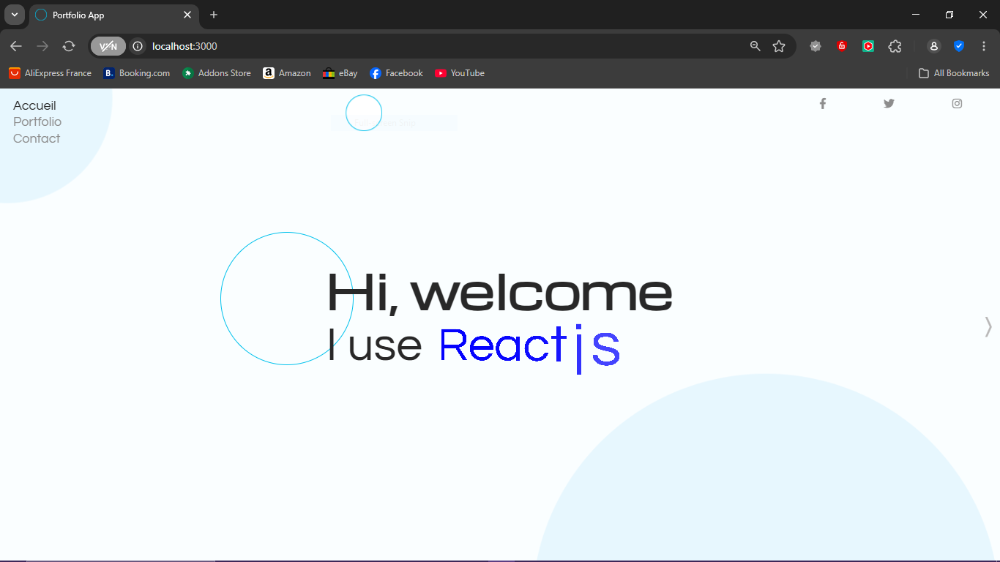
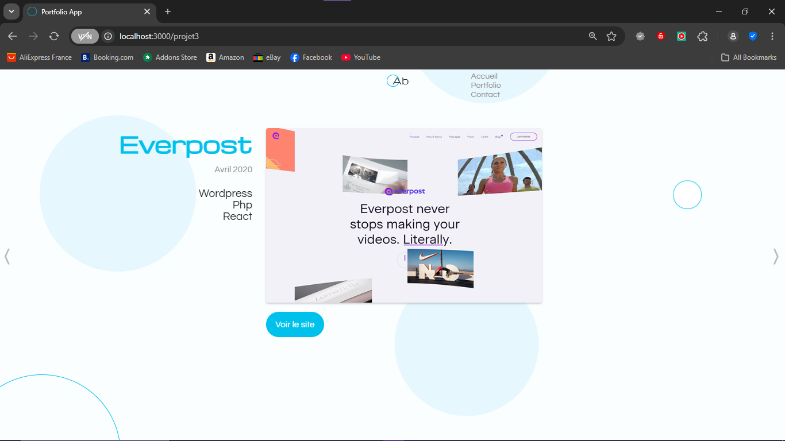
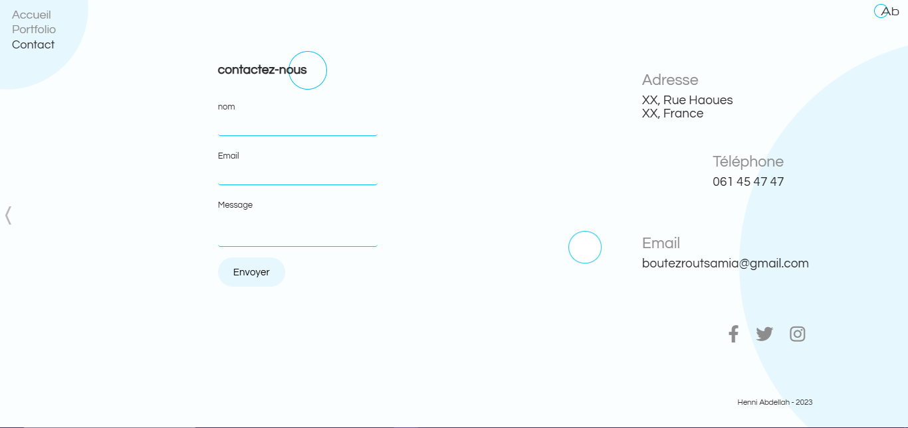

# Site Vitrine pour Agence avec Animation (Framer Motion JS)

Bienvenue sur le projet *Site Vitrine pour Agence avec Animation*! Cette application est une page unique animée, développée avec React et JavaScript. Elle comprend trois sections principales : Accueil, Portfolio et Contact. Conçue pour être moderne et interactive, elle utilise des animations fluides grâce à Framer Motion.

---

## Description
Animated single-page website created with React and JavaScript, featuring:
- **Home**: A welcoming introduction section.
- **Portfolio**: A showcase of projects or works.
- **Contact**: A form to get in touch, powered by EmailJS.

### Screenshots
Here are some visuals of the project:

1. **Accueil (Home)**  
     
   *Aperçu de la section d'accueil avec une animation d'entrée.*

2. **Portfolio**  
     
   *Exemple de la section portfolio avec des projets animés.*

3. **Contact**  
     
   *Formulaire de contact intégré avec EmailJS.*

---

## Scripts
Here are the available npm scripts to manage the project:
- `npm install`: Downloads dependencies and runs a postinstall build.
- `npm run dev`: Starts a development server with hot-reloading.
- `npm run build`: Builds a production-ready Webpack bundle.
- `npm start`: Launches the production server.

---

## Tech Stack
- **React.js**: For building the user interface.
- **JavaScript**: Core programming language.
- **EmailJS**: For handling contact form submissions.
- **Framer Motion**: For smooth animations.
- **Sass**: For styling with enhanced CSS features.

---

## Code Examples
Below are snippets showcasing key features of the project:

### 1. Home Section Animation (Framer Motion)
```jsx
import { motion } from 'framer-motion';

const Home = () => (
  <motion.div
    initial={{ opacity: 0, y: 50 }}
    animate={{ opacity: 1, y: 0 }}
    transition={{ duration: 1 }}
  >
    <h1>Bienvenue sur notre site</h1>
    <p>Une vitrine moderne pour votre agence.</p>
  </motion.div>
);

export default Home;