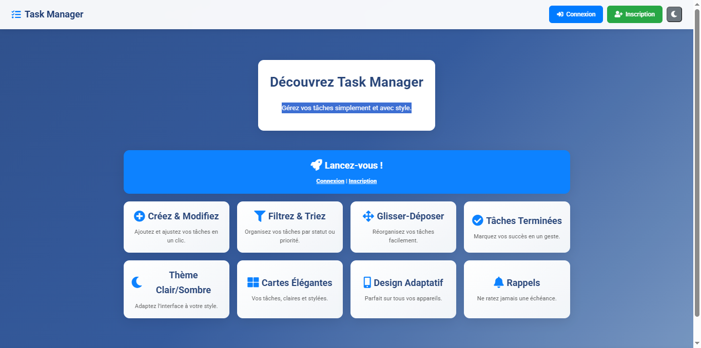
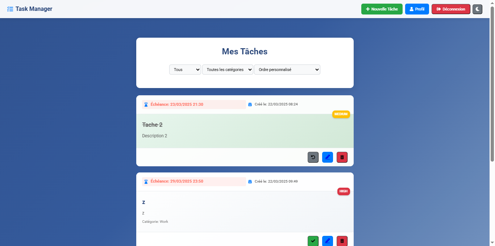
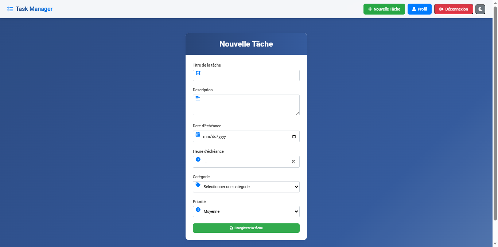
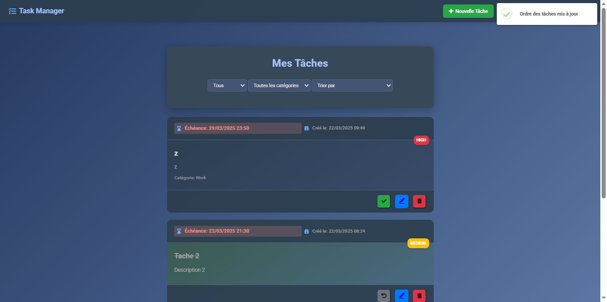

# Task Manager

## Introduction

Task Manager is built on the Laravel framework, a powerful and robust PHP framework that provides an elegant syntax and a rich set of features for web application development. Laravel's MVC architecture enables organized code structure, making it easier to develop and maintain the application.

## Laravel Features Used

- **Eloquent ORM**: Simplifies database interactions and allows for easy data manipulation.
- **Routing**: Simplifies the process of defining application URLs and their corresponding logic.
- **Blade Templating Engine**: Provides powerful templating capabilities with a concise syntax.
- **Middleware**: Offers a convenient mechanism to filter HTTP requests entering your application.
  
## App Features

- **Create Tasks**: Define your tasks clearly to keep your workload organized.
- **Modify Tasks**: Adjust your tasks as priorities change for better productivity.
- **View All Tasks**: Access all your tasks at a glance to stay on top of your workflow.
- **Delete Tasks**: Remove irrelevant or completed tasks to keep your task list tidy.

## Installation

1. Clone the repository:
    ```bash
    git clone https://github.com/yourusername/task-manager.git
    ```
2. Navigate to the project directory:
    ```bash
    cd task-manager
    ```
3. Install dependencies:
    ```bash
    composer install
    ```
4. Set up your `.env` file:
    ```bash
    cp .env.example .env
    ```
5. Generate the application key:
    ```bash
    php artisan key:generate
    ```
6. Run the migrations to set up the database:
    ```bash
    php artisan migrate
    ```

## Usage

To start the local server, use:
```bash
php artisan serve
```
You can now access the application at http://localhost:8000.

## Screenshots






